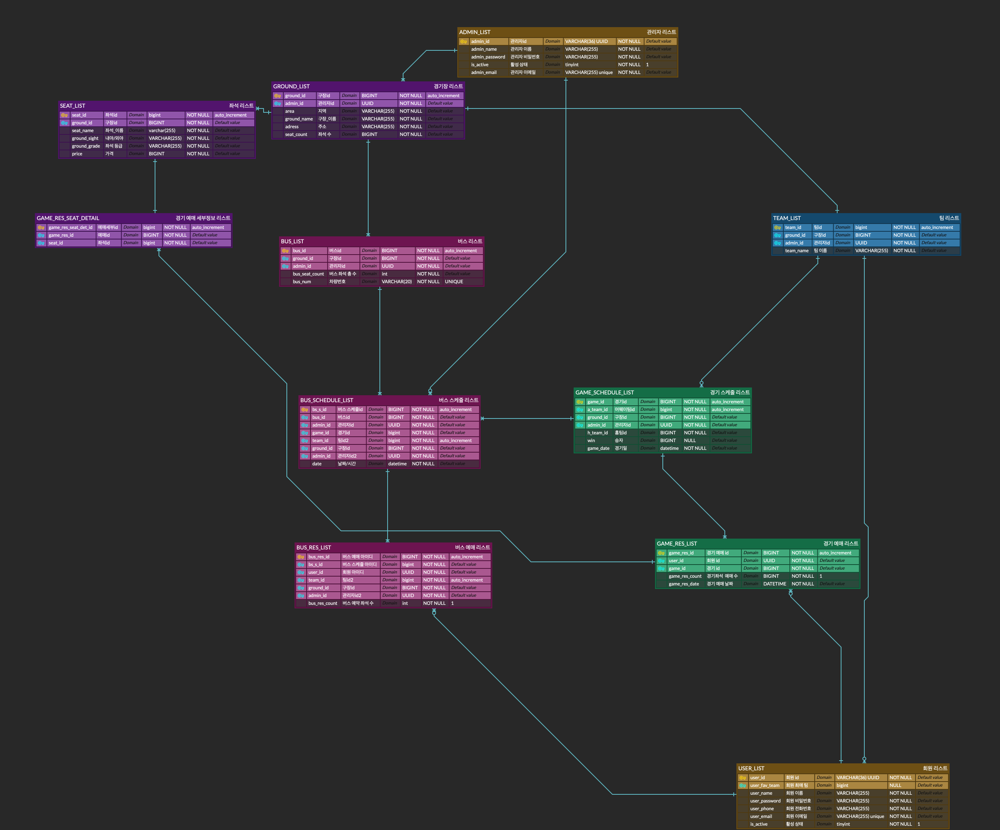

#  MHiT DB 프로젝트
<p align="center">

</p>

<div align="center">

# ⚾ 야구 예매와 셔틀 예약을 한 번에! 🚌

</div>


&nbsp;

---

**팀원**

김도균, 김태환, 황정윤, 홍진희

---

## 📌 프로젝트 개요  

- **MHiT** : 사용자가 원하는 야구 경기를 예매할 때 근방에서 해당 경기장까지 운행하는 셔틀 버스까지 예약할 수 있는 DB 중심의 프로젝트입니다.

- 실제 서비스 운영에 적합한 **ERD**를 설계하고, **SQL 쿼리와 프로시저가 요구사항대로 정확하게 실행되는지 테스트**하는 데 중점을 두었습니다.

---

## 스택
<p>


</p>

---

## 📅 프로젝트 기간  

**2025.12.04 ~ 2025.12.05**

---

## 🧭 진행흐름도


---

## ✨ 주요 기능

| 기능 구분 | 상세 기능 |
|----------|-----------|
| 🎟 **경기 예매** | - 구단 기준 경기 검색 <br> - 좌석 기반 예매 기능 <br> - 경기 예매 내역 조회 |
| 🚌 **셔틀버스 예약** | - 경기 일정과 연동된 셔틀버스 노선 조회 <br> -  이용 가능 버스 정보 조회 |
| 🏟 **구단 조회** | - 구단 기본 정보 조회 <br> - 구단 경기 일정 조회 <br> - 구단 승률, 선호 팬 수 조회 |
| ⚾ **경기 조회** | - 전체 경기 일정 조회 <br> - 특정 구단 경기 조회 <br> - 경기 결과(승/무/패), 경기 상태 확인 |
| 🏟 **구장 조회** | - 구장 정보(위치·좌석 수 등) 조회 <br> - 해당 구장의 경기 일정 조회 <br> - 연계 셔틀버스 정보 조회 |


---


## 🎯 서비스 대상

- 야구 경기를 관람하고 싶은 일반 사용자
- 경기 예매와 이동편(셔틀버스)을 한 번에 확인하고 싶어하는 사용자
- 구단 정보, 경기 일정, 구장 정보를 미리 알고 싶어하는 사용자
- 실시간으로 경기 결과·승률·순위 등을 확인하고 싶은 야구 팬
- 여러 앱을 켜지 않고 하나의 플랫폼에서 경기 관람 준비를 하고 싶은 사용자


---


## 🔥 타 서비스와의 차별점

### 🚌 경기 예매와 셔틀버스 정보를 하나의 서비스에서 제공
경기 예매와 동시에 해당 경기장의 셔틀버스 정보를 확인할 수 있는  
통합형 야구 관람 지원 서비스입니다.


---


## 🎯 기대효과

### 1️⃣ 사용자 편의성 향상
- 경기 예매와 셔틀버스 예약을 한 번에 처리할 수 있어 번거로움 최소화
- 경기장까지의 이동 수단을 미리 확보하여 관람 경험이 쾌적해짐

### 2️⃣ 원활한 이동 동선 확보
- 셔틀버스 예약으로 경기장 주변 교통 혼잡 완화
- 불필요한 대기시간 감소


---

## 📎 프로젝트 주요 산출물  

각 항목은 클릭하여 확인하거나 다운로드할 수 있습니다.

- 📘 **[요구사항 정의서](https://docs.google.com/spreadsheets/d/1KQKxB8eO9gHyPbQbWEiC2BqMWqx1NzDDvSr9orACbNc/edit?gid=200263830#gid=200263830)**  
  프로젝트 기능 정의 및 상세 요구사항 정리

- 📙 **[WBS (작업 분류 체계)](https://docs.google.com/spreadsheets/d/1KQKxB8eO9gHyPbQbWEiC2BqMWqx1NzDDvSr9orACbNc/edit?gid=602560201#gid=602560201)**  
  전체 프로젝트 일정과 작업 흐름 구성

- 🗺️ **ERD (Database Schema)**  
<p align="center">
  
</p>


---

### 쿼리

  <details>
  <summary><b>DDL</b></summary>

```sql
 -- 1. 관리자 테이블 
create table admin_list(
  admin_id varchar(36) not null primary key default (uuid()),
  admin_name varchar(255) not null, 
  admin_password varchar(255) not null);

  alter table admin_list add column is_active tinyint default 1;


 --2. 유저 테이블
create table user_list(
  user_id varchar(36) not null primary key default (uuid()), 
  user_name varchar(255) not null, 
  admin_password varchar(255) not null, 
  user_phone varchar(255) not null, 
  user_email varchar(255) not null, 
  user_fav_team bigint);

alter table user_list add constraint 
  foreign key (user_fav_team) references team_list(team_id) 
  on delete set null on update cascade;

alter table user_list add column is_active tinyint default 1;


 -- 3. 팀 테이블
 create table team_list(
    team_id bigint auto_increment primary key, 
    ground_id bigint not null, 
    admin_id varchar(36) NOT NULL, 
    team_name varchar(255) not null, 
    foreign key(ground_id) references ground_list(ground_id), 
    foreign key(admin_id) references admin_list(admin_id));


-- 4. 경기장 테이블
--경기장 정보
create table ground_list(  
    ground_id bigint not null auto_increment,admin_id varchar(36) not null,
    area varchar(255) not null,ground_name varchar(255),
    address varchar(255) not null,seat_count bigint not null,
    primary key(ground_id),
    foreign key (admin_id) references admin(admin_id)
);

--경기장 좌석 정보
create table seat_list( 
    seat_id bigint not null auto_increment,ground_id bigint not null,
    seat_name varchar(255) not null,ground_sight varchar(255)not null,
    ground_grade varchar(255) not null,price bigint not null,
    primary key(seat_id), 
    foreign key (ground_id) references ground_list(ground_id)
);

-- 5. 경기 테이블 
--경기 일정
create table game_schedule_list( 
    game_id bigint auto_increment primary key,
    ground_id bigint not null,
    admin_id vARCHAR(36) NOT NULL,
    h_team_id bigint not null,
    a_team_id bigint not null,
    win bigint,
    foreign key(ground_id) references ground_list(ground_id),
    foreign key(admin_id) references admin_list(admin_id));

alter table game_schedule_list add column game_date datetime;
alter table game_schedule_list modify column game_date datetime not null;


-- 6. 버스 테이블
-- 버스 정보
CREATE TABLE bus_list(
    bus_id BIGINT NOT NULL auto_increment,
    ground_id BIGINT NOT NULL,
    admin_id VARCHAR(36) NOT NULL,
    bus_seat_count INT,
    bus_num VARCHAR(20) NOT NULL UNIQUE,
    is_active TINYINT NOT NULL DEFAULT 1,
    PRIMARY KEY (bus_id),
    FOREIGN KEY (admin_id) REFERENCES admin_list (admin_id)
);

-- 버스시간
CREATE TABLE bus_schedule_list(
    bs_s_id BIGINT NOT NULL auto_increment,
    bus_id BIGINT NOT NULL,
    admin_id VARCHAR(36) NOT NULL,
    game_id BIGINT NOT NULL,
    schedule_time    TIMESTAMP,
    PRIMARY KEY (bs_s_id),
    FOREIGN KEY (bus_id) REFERENCES bus_list (bus_id),
    FOREIGN KEY (admin_id) REFERENCES admin_list  (admin_id),
    FOREIGN KEY (game_id) REFERENCES game_schedule_list (game_id)
);


-- 7. 예매 테이블
--경기 예매 
create table game_res_list(
    game_res_id bigint auto_increment primary key,
    user_id varchar(36) not null, 
    game_id bigint NOT NULL, 
    game_res_count bigint not null, 
    game_res_date datetime not null, 
    foreign key(user_id) references user_list(user_id), 
    foreign key(game_id) references game_schedule_list(game_id));

--좌석 예매
create table game_res_seat_detail(
    game_res_seat_detail_id bigint not null auto_increment,
    game_res_id bigint not null,seat_id bigint not null,
    primary key(game_res_seat_detail_id), 
    foreign key(game_res_id) references game_res_list(game_res_id),
    foreign key(seat_id) references seat_list(seat_id)
);

--버스 예매

CREATE TABLE bus_res_list (
    bus_res_id BIGINT NOT NULL auto_increment,
    bs_s_id BIGINT,
    user_id VARCHAR(36) NOT NULL,
    bus_res_count INT,
    PRIMARY KEY (bus_res_id),
    FOREIGN KEY (bs_s_id) REFERENCES bus_schedule_list (bs_s_id),
    FOREIGN KEY (user_id) REFERENCES user_list (user_id)
);

```
</details>

  <details>
  <summary><b>회원기능</b></summary>

```sql


-- 1. 회원가입 프로시저
delimiter //
create procedure register_user(in id_name varchar(255),
in password_in varchar(255),
in phone_in varchar(255),
in email_in varchar(255), 
in fav_team_in varchar(255))
begin
    declare T_id bigint(20);
    
    -- 좋아하는 팀 명을 적으면 id값으로 변환
    select team_id into T_id from team_list 
    where team_name = fav_team_in ;

    -- email 중복 조회 
    if exists (
        select 1 from user_list
        where user_email = email_in
        )
        then 
			signal sqlstate '45000' 
			set message_text = "이미 등록된 이메일입니다. ";

    else 
    insert into user_list (
        user_name, user_password, user_phone, user_email, user_fav_team
    )
    values (
        id_name, password_in, phone_in, email_in, register_userT_id) ;
    end if;
end //
delimiter ;

-- 2. 회원정보수정 
delimiter //
create procedure user_info_update(in name_in varchar(255),
in password_in varchar(255),
in phone_in varchar(255),
in old_email_in varchar(255), 
in new_email_in varchar(255), 
in fav_team_in varchar(255))

begin
    declare T_id bigint(20);
    -- 좋아하는 팀 명을 적으면 id값으로 변환
    select team_id into T_id 
    from team_list 
    where team_name = fav_team_in ;

    -- email 중복 조회 
    if exists (
        select 1 from user_list
        where user_email = new_email_in
        )
        then 
			signal sqlstate '45000' 
			set message_text = "이미 등록된 이메일입니다. ";

    else 
    -- 입력한 기존email이 맞을시, 수정
    update user_list
    set 
        user_name=name_in, 
        user_password=password_in, 
        user_phone=phone_in, 
        user_email=new_email_in, 
        user_fav_team=T_id
        where user_email=old_email_in;
    end if;
end //
delimiter ;

-- 3. 회원정보조회
delimiter //
create procedure get_user_info(
in password_in varchar(255),
in email_in varchar(255))

begin
    select user_name, user_phone,user_email,t.team_name 
    from user_list l left join team_list t 
        on l.user_fav_team=t.team_id 
    where user_email='hong1@naver.com';
end //
delimiter ;

--회원탈퇴
delimiter //
create procedure delete_user(
in password_in varchar(255),
in email_in varchar(255))

begin
    update user_list set is_active = 0 
    where user_password=password_in and user_email=email_in;
end //
delimiter ;


```
</details>


  <details>
  <summary><b>조회</b></summary>

```sql

-- 1. 구단조회
-- 구단정보조회
delimiter //
create procedure team_add(in team_Name varchar(255))
begin
	select t.team_name, g.area, g.ground_name, g.address, g.seat_count, s.seat_name, s.ground_sight, s.ground_grade, s.price 
    from team_list t 
    inner join ground_list g on t.ground_id=g.ground_id 
    inner join seat_list s on t.ground_id=s.ground_id 
    where t.team_name=team_Name;
end
// delimiter ;


-- 구단경기조회
delimiter //
create procedure game_search(in team_Name varchar(255))
begin
	select 
    home_t.team_name as home_team,
    g.ground_name,
    away_t.team_name as away_team,
    case 
        when gs.win = 1 then '승'
        when gs.win = 2 then '패'
        when gs.win = 0 then '무승부'
        else '경기 시작전'
    end as result,
    gs.game_date
from ground_list g
inner join team_list home_t 
    on g.ground_id = home_t.ground_id
inner join game_schedule_list gs 
    on g.ground_id = gs.ground_id
inner join team_list away_t
    on gs.a_team_id = away_t.team_id
    where home_t.team_name=team_Name;
end
// delimiter ;


-- 구단 좋아요 수, 승률 정보 조회
delimiter //

create procedure team_stats(
    in p_team_name varchar(255)
)
begin
    select
        t.team_id,
        t.team_name,
        count(distinct u.user_id) as fav_user_count,
        sum(
            case
                when (gs.h_team_id = t.team_id and gs.win = 1)
                     or (gs.a_team_id = t.team_id and gs.win = 2)
                then 1
                else 0
            end
        ) as wins,

        sum(
            case
                when (gs.h_team_id = t.team_id and gs.win = 2)
                     or (gs.a_team_id = t.team_id and gs.win = 1)
                then 1
                else 0
            end
        ) as losses,

        round(
            (
                sum(
                    case
                        when (gs.h_team_id = t.team_id and gs.win = 1)
                             or (gs.a_team_id = t.team_id and gs.win = 2)
                        then 1
                        else 0
                    end
                )
                /
                nullif(
                    sum(
                        case 
                            when gs.win in (1,2) then 1
                            else 0
                        end
                    ),
                    0
                ) * 100
            ),
            2
        ) as win_rate
    from team_list t
    left join user_list u on u.user_fav_team = t.team_id
    left join game_schedule_list gs on gs.h_team_id = t.team_id or gs.a_team_id = t.team_id
    where t.team_name = p_team_name
    group by
        t.team_id,
        t.team_name;
end
// delimiter ;


-- 2. 구장정보조회
delimiter //

create procedure get_ground_detail(
    in p_ground_id bigint
)
begin
    select 
        ground_id,
        admin_id,
        area,
        ground_name,
        address,
        seat_count,
        ground_status
    from ground_list
    where ground_id = p_ground_id;
end//

delimiter ;


-- 3. 버스조회
-- 버스 정보 조회
DELIMITER //

CREATE PROCEDURE show_available_bus(
    IN p_game_id BIGINT
)
BEGIN
    SELECT
        bs.bs_s_id,
        bs.game_id,
        DATE_FORMAT(gs.game_date, '%Y.%m.%d %H:%i') AS game_date,
        DATE_FORMAT(bs.schedule_time, '%Y.%m.%d %H:%i') AS bus_date,
        b.bus_id,
        b.bus_num,
        b.bus_seat_count,
        IFNULL(SUM(br.bus_res_count), 0) AS reserved_count,
        b.bus_seat_count - IFNULL(SUM(br.bus_res_count), 0) AS remain_seat
    FROM bus_schedule_list AS bs
    JOIN game_schedule_list AS gs
        ON gs.game_id = bs.game_id
    JOIN bus_list AS b
        ON b.bus_id = bs.bus_id
    LEFT JOIN bus_res_list AS br
        ON br.bs_s_id = bs.bs_s_id
    WHERE bs.game_id   = p_game_id
      AND bs.is_canceled = 0
      AND b.is_active   = 1
      AND gs.game_date  > NOW()
    GROUP BY
        bs.bs_s_id,
        bs.game_id,
        gs.game_date,
        bs.schedule_time,
        b.bus_id,
        b.bus_num,
        b.bus_seat_count
    HAVING
        b.bus_seat_count > IFNULL(SUM(br.bus_res_count), 0)
    ORDER BY
        remain_seat DESC,
        b.bus_id ASC;
END //

DELIMITER ;

-- 예약 가능한 버스 조회
DELIMITER //

CREATE PROCEDURE show_available_bus(
    IN p_game_id BIGINT
)
BEGIN
    SELECT
        bs.bs_s_id,
        bs.game_id,
        DATE_FORMAT(gs.game_date, '%Y.%m.%d %H:%i') AS game_date,
        DATE_FORMAT(bs.schedule_time, '%Y.%m.%d %H:%i') AS bus_date,
        b.bus_id,
        b.bus_num,
        b.bus_seat_count,
        IFNULL(SUM(br.bus_res_count), 0) AS reserved_count,
        b.bus_seat_count - IFNULL(SUM(br.bus_res_count), 0) AS remain_seat
    FROM bus_schedule_list AS bs
    JOIN game_schedule_list AS gs
        ON gs.game_id = bs.game_id
    JOIN bus_list AS b
        ON b.bus_id = bs.bus_id
    LEFT JOIN bus_res_list AS br
        ON br.bs_s_id = bs.bs_s_id
    WHERE bs.game_id   = p_game_id
      AND bs.is_canceled = 0
      AND b.is_active   = 1
      AND gs.game_date  > NOW()
    GROUP BY
        bs.bs_s_id,
        bs.game_id,
        gs.game_date,
        bs.schedule_time,
        b.bus_id,
        b.bus_num,
        b.bus_seat_count
    HAVING
        b.bus_seat_count > IFNULL(SUM(br.bus_res_count), 0)
    ORDER BY
        remain_seat DESC,
        b.bus_id ASC;
END //

DELIMITER ;


```
</details>

  <details>
  <summary><b>예매</b></summary>

```sql


-- 1.경기예매
CREATE PROCEDURE game_res(
    IN p_user_id        VARCHAR(36),
    IN p_game_id        BIGINT,
    IN p_game_res_count INT
)
BEGIN
    DECLARE v_dummy BIGINT;

    -- 에러 나면 자동으로 롤백하고 에러 다시 던지기
    DECLARE EXIT HANDLER FOR SQLEXCEPTION
    BEGIN
        ROLLBACK;
        RESIGNAL;
    END;

    START TRANSACTION;

    SELECT game_res_id
      INTO v_dummy
      FROM game_res_list
     WHERE user_id = p_user_id
       AND game_id = p_game_id
     FOR UPDATE;

    INSERT INTO game_res_list (
        user_id,
        game_id,
        game_res_count,
        game_res_date
    )
    VALUES (
        p_user_id,
        p_game_id,
        p_game_res_count,
        NOW()
    );

    COMMIT;
END //

DELIMITER ;

-- 2. 버스예매
----- 버스 예약 -----

DELIMITER //

CREATE PROCEDURE insert_bus_reservation(
    IN p_bs_s_id       BIGINT,
    IN p_user_id       VARCHAR(36),
    IN p_bus_res_count INT
)
BEGIN
    DECLARE v_game_id          BIGINT;
    DECLARE v_bus_id           BIGINT;
    DECLARE v_is_canceled      TINYINT;
    DECLARE v_bus_seat_count   INT;
    DECLARE v_bus_is_active    TINYINT;
    DECLARE v_has_game_res     INT;
    DECLARE v_current_reserved INT;
    DECLARE v_remain           INT;
    DECLARE v_dup              INT;
    DECLARE v_msg              TEXT;

    DECLARE EXIT HANDLER FOR SQLEXCEPTION
    BEGIN
        ROLLBACK;
        RESIGNAL;
    END;

    START TRANSACTION;

    -- 스케줄/게임 정보
    SELECT game_id, bus_id, is_canceled
      INTO v_game_id, v_bus_id, v_is_canceled
      FROM bus_schedule_list
     WHERE bs_s_id = p_bs_s_id;

    IF v_game_id IS NULL THEN
        SET v_msg = '유효하지 않은 버스 스케줄입니다.';
        SIGNAL SQLSTATE '45000' SET MESSAGE_TEXT = v_msg;
    END IF;

    IF v_is_canceled = 1 THEN
        SET v_msg = '취소된 버스 스케줄입니다.';
        SIGNAL SQLSTATE '45000' SET MESSAGE_TEXT = v_msg;
    END IF;

    -- 경기 예약 여부 확인
    SELECT COUNT(*)
      INTO v_has_game_res
      FROM game_res_list
     WHERE user_id = p_user_id
       AND game_id = v_game_id;

    IF v_has_game_res = 0 THEN
        SET v_msg = '잘못된 요청입니다.';
        SIGNAL SQLSTATE '45000' SET MESSAGE_TEXT = v_msg;
    END IF;

    -- 버스 기본 정보 좌석수/활성 여부
    SELECT bus_seat_count, is_active
      INTO v_bus_seat_count, v_bus_is_active
      FROM bus_list
     WHERE bus_id = v_bus_id;

    IF v_bus_seat_count IS NULL THEN
        SET v_msg = '버스 정보가 존재하지 않습니다.';
        SIGNAL SQLSTATE '45000' SET MESSAGE_TEXT = v_msg;
    END IF;

    IF v_bus_is_active = 0 THEN
        SET v_msg = '비활성화된 버스입니다.';
        SIGNAL SQLSTATE '45000' SET MESSAGE_TEXT = v_msg;
    END IF;

    -- bus_res_list 잠그면서 처리

    -- 같은 유저의 중복 예약 확인 + 잠금
    SELECT COUNT(*)
      INTO v_dup
      FROM bus_res_list
     WHERE bs_s_id = p_bs_s_id
       AND user_id = p_user_id
     FOR UPDATE;

    IF v_dup > 0 THEN
        SET v_msg = '이미 이 버스를 예약한 사용자입니다.';
        SIGNAL SQLSTATE '45000' SET MESSAGE_TEXT = v_msg;
    END IF;

    -- 현재 예약 인원 합계 + 잠금
    SELECT IFNULL(SUM(bus_res_count), 0)
      INTO v_current_reserved
      FROM bus_res_list
     WHERE bs_s_id = p_bs_s_id
     FOR UPDATE;

    SET v_remain = v_bus_seat_count - v_current_reserved;

    IF p_bus_res_count > v_remain THEN
        SET v_msg = CONCAT('예약 가능 인원이 부족합니다. 남은 좌석: ', v_remain);
        SIGNAL SQLSTATE '45000' SET MESSAGE_TEXT = v_msg;
    END IF;

    -- 5) INSERT
    INSERT INTO bus_res_list (bs_s_id, user_id, bus_res_count)
    VALUES (p_bs_s_id, p_user_id, p_bus_res_count);

    COMMIT;

    SELECT '버스 예약이 완료되었습니다.' AS message,
           v_bus_id                              AS bus_id,
           p_bs_s_id                             AS bs_s_id,
           p_bus_res_count                       AS reserved_count,
           v_remain - p_bus_res_count            AS remain_seat_after;
END //

DELIMITER ;


```
</details>

  <details>
  <summary><b>관리</b></summary>

```sql

-- 1.구단관리
-- 구단 등록
delimiter //
create procedure team_add(in ground_Id bigint, in admin_Id varchar(36), in team_Name varchar(255))
begin
	insert into team_list(ground_id, admin_id, team_name)
    values (ground_Id, admin_Id, team_Name);
end
// delimiter ;

-- 구단 수정
delimiter //
create procedure team_update(in ground_Name varchar(255), in team_Name varchar(255))
begin
	update team_list set ground_id=(select ground_id from ground_list where ground_name=ground_Name limit 1) where team_id=(select team_id from team_list where team_name=team_Name limit 1);
end
// delimiter ;

-- 구단 삭제
delimiter //
create procedure team_del(in team_Name varchar(255))
begin
	update team_list set team_status=0 where team_id=(select team_id from team_list where team_name=team_Name);
end
// delimiter ;


-- 2. 구장관리
-- 구장 등록
delimiter //

create procedure register_ground (
    in  p_admin_id      varchar(36),
    in  p_area          varchar(255),
    in  p_ground_name   varchar(255),
    in  p_address       varchar(255),
    in  p_seat_count    bigint,
    out p_new_ground_id bigint
)
begin
    insert into ground_list (
        admin_id,
        area,
        ground_name,
        address,
        seat_count
    ) values (
        p_admin_id,
        p_area,
        p_ground_name,
        p_address,
        p_seat_count
    );

    
    set p_new_ground_id = last_insert_id();
end//

delimiter ;

-- 구장 수정 
delimiter //

create procedure update_ground (
    in p_ground_id     bigint,
    in p_area          varchar(255),
    in p_ground_name   varchar(255),
    in p_address       varchar(255),
    in p_seat_count    bigint
)
begin
    update ground_list
    set 
        area = p_area,
        ground_name = p_ground_name,
        address = p_address,
        seat_count = p_seat_count
    where ground_id = p_ground_id;
end//

delimiter ;

-- 구장 삭제
delimiter //

create procedure delete_ground (
    in p_ground_id bigint
)
begin
    update ground_list
    set ground_status = 0   -- 0 = 삭제
    where ground_id = p_ground_id;
end//

delimiter ;


-- 3.버스관리
-- 버스등록
DELIMITER //

CREATE PROCEDURE insert_bus_one(
    IN p_ground_id      BIGINT,
    IN p_admin_id       VARCHAR(36),
    IN p_bus_seat_count INT,
    IN p_bus_num        VARCHAR(20)
)
BEGIN
    DECLARE v_cnt INT;

    -- 이미 존재하는 차량번호인지 확인
    SELECT COUNT(*)
      INTO v_cnt
      FROM bus_list
     WHERE bus_num = p_bus_num;

    -- 있으면 안내 메시지만 출력
    IF v_cnt > 0 THEN
        SELECT CONCAT('이미 등록된 차량번호입니다: ', p_bus_num) AS message;

    -- 없으면 INSERT + 성공 메시지
    ELSE
        INSERT INTO bus_list (
            ground_id,
            admin_id,
            bus_seat_count,
            bus_num
        )
        VALUES (
            p_ground_id,
            p_admin_id,
            p_bus_seat_count,
            p_bus_num
        );

        SELECT CONCAT('버스가 정상적으로 등록되었습니다: ', p_bus_num) AS message;
    END IF;
END //


-- 버스 수정
DELIMITER //

CREATE PROCEDURE update_bus_info(
    IN p_bus_id         BIGINT,
    IN p_ground_id      BIGINT,    -- NULL 이면 변경하지 않음
    IN p_bus_seat_count INT        -- NULL 이면 변경하지 않음
)
BEGIN
    UPDATE bus_list
    SET ground_id      = COALESCE(p_ground_id, ground_id),
        bus_seat_count = COALESCE(p_bus_seat_count, bus_seat_count)
    WHERE bus_id = p_bus_id;
END //

DELIMITER ;

--버스 사용/미사용
DELIMITER //

CREATE PROCEDURE change_bus_active(
    IN p_bus_id BIGINT
)
BEGIN
    UPDATE bus_list
    SET is_active = 1 - is_active
    WHERE bus_id = p_bus_id;
END //

DELIMITER ;

-- 버스스케줄등록
DELIMITER //

CREATE PROCEDURE insert_bus_schedule(
    IN p_game_id  BIGINT,
    IN p_admin_id VARCHAR(36)   -- NULL/'' 이면 bus_list.admin_id 사용
)
BEGIN
    INSERT INTO bus_schedule_list (
        bus_id,
        admin_id,
        game_id,
        schedule_time
    )
    SELECT
        b.bus_id,
        CASE
            WHEN p_admin_id IS NULL OR p_admin_id = '' THEN b.admin_id
            ELSE p_admin_id
        END AS admin_id,
        gs.game_id,
        DATE_SUB(gs.game_date, INTERVAL 1 HOUR) AS schedule_time
    FROM bus_list AS b
    JOIN game_schedule_list AS gs
        ON gs.ground_id = b.ground_id
    LEFT JOIN bus_schedule_list AS bs
        ON bs.bus_id  = b.bus_id
       AND bs.game_id = gs.game_id
    WHERE gs.game_id = p_game_id      
      AND gs.game_date > NOW()        
      AND bs.bus_id IS NULL           
      AND b.is_active = 1;            
END //

DELIMITER ;

-- 버스스케줄삭제
DELIMITER //

CREATE PROCEDURE change_bus_schedule_active(
    IN p_bs_s_id BIGINT
)
BEGIN
    UPDATE bus_schedule_list
    SET is_canceled = 1 - is_canceled
    WHERE bs_s_id = p_bs_s_id;
END //

DELIMITER ;
